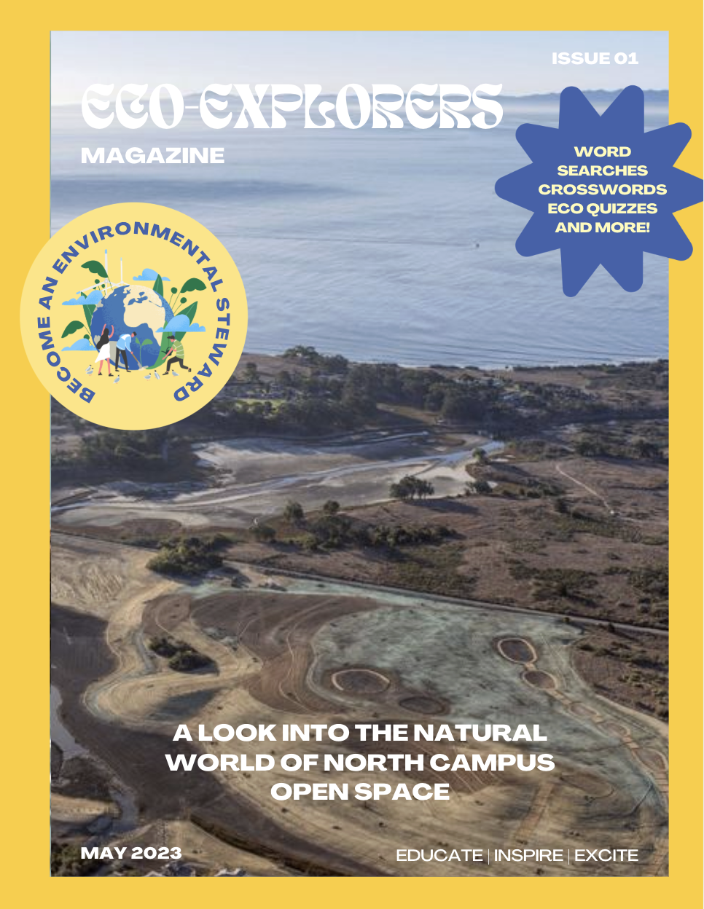
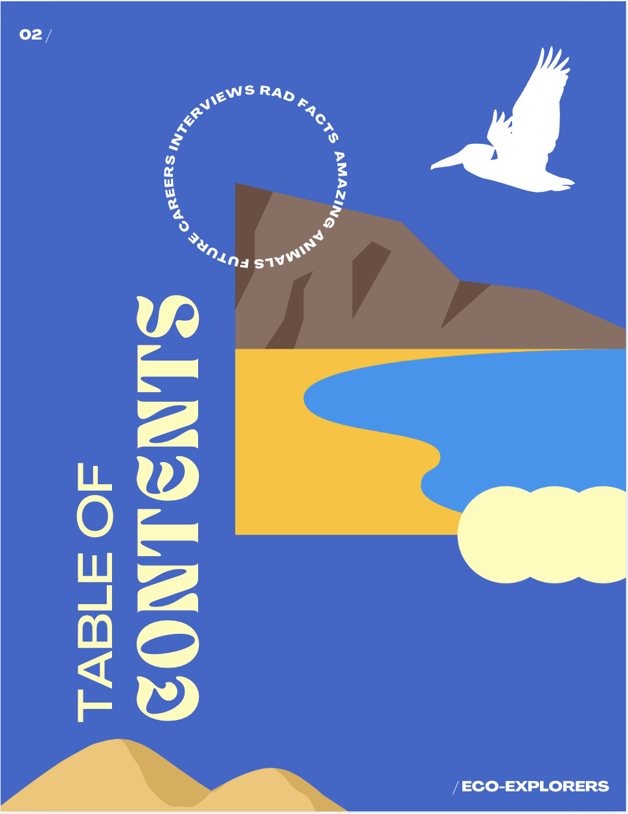
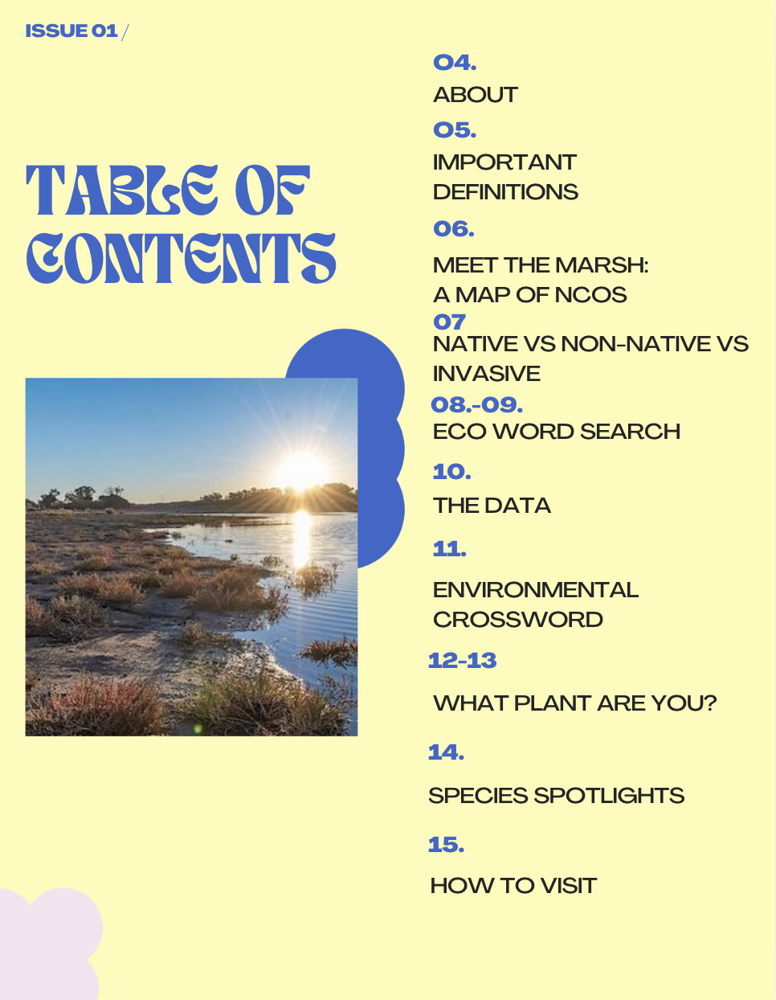
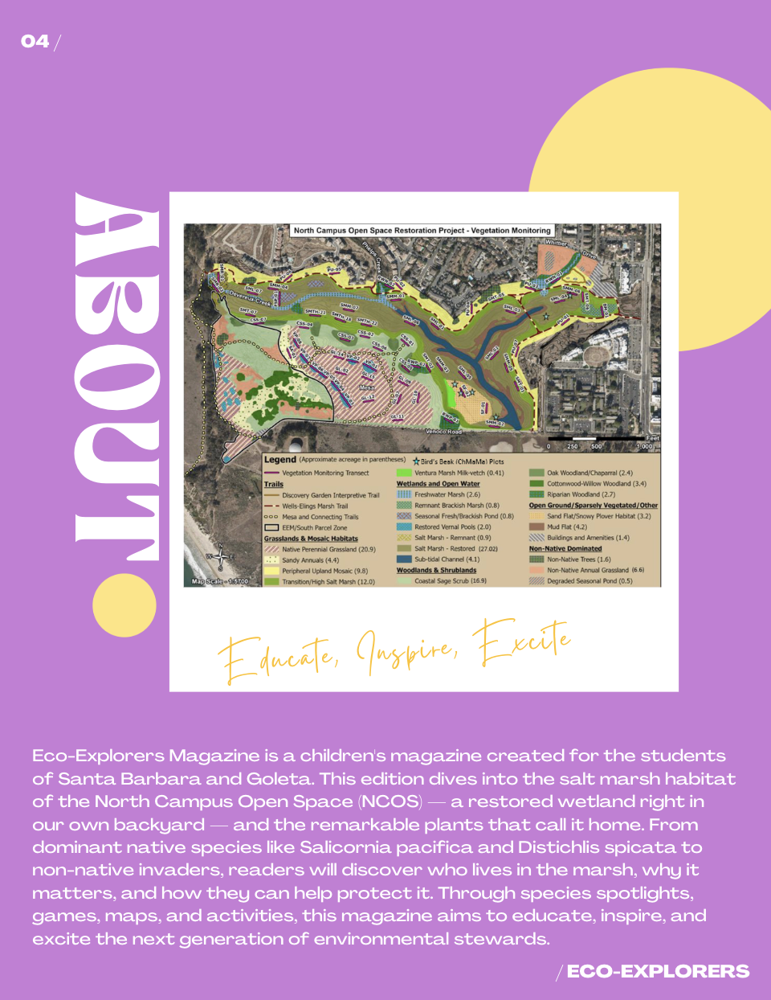
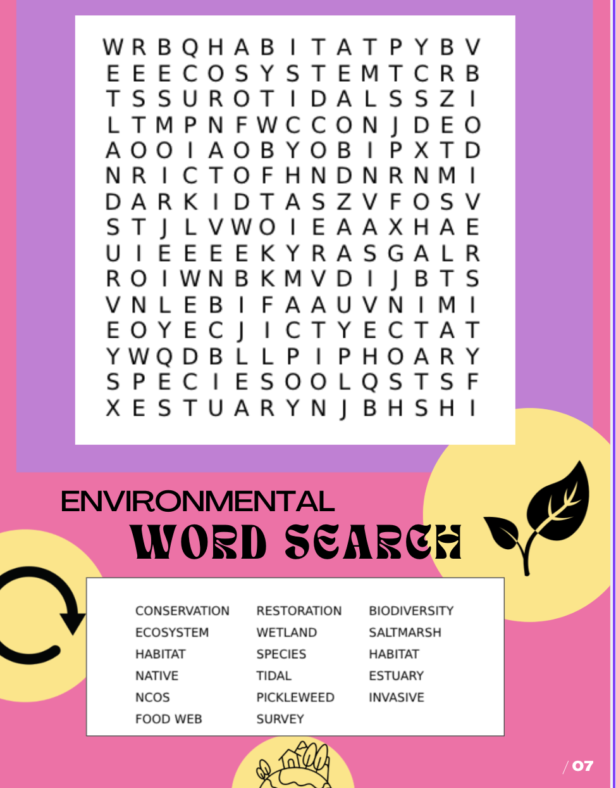

# Setup

## Packages

We loaded packages for data wrangling, file organization, missing-data exploration, and visualization. The main workflow uses `tidyverse` for cleaning and summarizing vegetation data, `here` for file paths, and plotting packages for exploratory figures.

```{r}
#| label: packages
#| echo: false

# Loading general use packages
library(tidyverse)

# File organization
library(here)

# Data visualization
library(patchwork)
library(naniar)
```

## Data 

We used two vegetation datasets. The main dataset, `veg.csv`, contains vegetation survey observations, including species identity, percent cover, cover category, habitat type, transect, site, and year. The metadata file, `vp_veg_metadata.csv`, provides supporting information about vegetation transects, including the number of quadrats sampled within each transect-year.

```{r}
#| label: read-data
#| echo: false

# Reading in vegetation survey data
veg <- read_csv(here("data", "veg.csv"))

metadata <- read_csv(here("data", "vp_veg_metadata.csv"))
```

# Ideas for analysis and background 

Our project focuses on salt marsh vegetation at North Campus Open Space (NCOS), with the goal of understanding which plant species characterize this restored wetland habitat and how those patterns have changed across survey years. Rather than treating vegetation cover as only a set of numbers, we are using percent cover to describe how the salt marsh is developing as a plant community over time. In this sense, our project asks how restoration becomes visible through the species that take root, persist, expand, or decline across the marsh.

Salt marsh vegetation is especially useful for understanding restoration trajectory because these plant communities are shaped by strong environmental filters, including salinity, tidal flooding, saturated soils, and seasonal changes in water availability. In southern California salt marshes, native halophytes such as pickleweed (*Salicornia pacifica*) and saltgrass (*Distichlis spicata*) often help define the structure and identity of the habitat [@ferren_1985; @ncos_coastal_salt_marsh]. Because these species are adapted to stressful coastal wetland conditions, changes in their mean percent cover can help indicate whether the restored salt marsh is developing toward a recognizable native marsh community.

This question is particularly relevant at NCOS because the site was restored from the former Ocean Meadows Golf Course into a mosaic of wetland and upland habitats, including salt marsh, brackish marsh, seasonal wetlands, and transitional habitats [@ncos_restoration_plan_2016; @ncos_monitoring_2024]. Broader NCOS monitoring reports evaluate restoration progress across habitat types, while our project narrows in on salt marsh vegetation specifically. By focusing on dominant species and native/non-native cover through time, we can connect the survey data to larger questions about restoration progress, habitat identity, and community development.

Previous work on California wetland restoration has shown that vegetation establishment can be slow, variable, and strongly shaped by local site conditions such as elevation, soil salinity, soil moisture, planting, and adaptive management [@beheshti_2023]. This matters for our analysis because shifts in dominant plant cover are not just visual patterns in a graph. They may reflect ecological processes such as native plant establishment, non-native plant expansion, hydrologic change, disturbance, or interannual variability in rainfall and growing conditions.

## Ecological background

Salt marshes are dynamic coastal wetlands where plant communities exist at the edge of land and water. Their vegetation patterns are shaped by both physical stress and biological interactions, making them useful indicators of environmental conditions and restoration progress. In southern California, seasonal rainfall and dry summers can influence freshwater input, soil moisture, salinity, and plant growth, which may affect how vegetation cover changes from year to year [@ferren_1985].

At NCOS, we expect dominant salt marsh species to include native salt-tolerant plants such as *Salicornia pacifica* and *Distichlis spicata*. The NCOS coastal salt marsh habitat page describes pickleweed as usually the dominant species in coastal salt marshes and also identifies saltgrass, alkali heath, fleshy jaumea, and California saltbush as characteristic salt marsh plants [@ncos_coastal_salt_marsh]. These expectations give us a useful ecological reference point for interpreting our data: if the restored salt marsh is developing toward a recognizable coastal salt marsh community, we would expect these native halophytes to contribute strongly to vegetation cover.

Native and non-native cover are also important to examine because restoration success depends not only on whether plants are present, but on which plants are shaping the habitat. A marsh with high total vegetation cover may still be ecologically different depending on whether that cover is dominated by native salt marsh species or by non-native plants. NCOS monitoring reports describe vegetation cover, native biodiversity, and relative native cover as important indicators of restoration progress [@ncos_monitoring_2024]. Our project builds from that monitoring context by focusing more closely on the species-level patterns that contribute to salt marsh identity through time.

## Planned analyses 

Our first analysis will identify which plant species most strongly characterize salt marsh and closely related brackish marsh vegetation at NCOS. To do this, we will summarize mean percent cover for each plant species across survey years and transects, then rank species from highest to lowest mean cover. This species-rank analysis will help us justify which species we classify as dominant rather than choosing them only from visual inspection.

Our second analysis will examine how the top five dominant species change across survey years. After identifying the five species with the highest mean percent cover across the full filtered dataset, we will summarize their mean percent cover by year and visualize them with a stacked bar plot. In this figure, the y-axis represents the summed mean percent cover of only the top five dominant species, so bar height shows how much cover those dominant species contribute in each year.

Our third analysis will focus specifically on non-native species in the filtered salt marsh/brackish marsh dataset. Rather than only comparing total native and non-native cover, we will identify the five non-native species with the highest mean percent cover across all survey years, then summarize their mean percent cover by year. We will visualize these species with a stacked bar plot so we can see whether non-native cover is being driven by the same species through time or whether different non-native plants become more important in different years. This analysis is useful because a simple native/non-native proportion plot can show the relative amount of non-native cover, but it does not show which species are responsible for that pattern. By focusing on the top non-native species, we can connect non-native cover to actual plant identities and better interpret whether non-native vegetation reflects a consistent community pattern, a temporary increase in a few species, or a shift in the plants contributing to marsh composition.

Our fourth analysis will provide broader context by examining total vegetation cover across survey years. Unlike the dominant-species figure, this analysis includes all native and non-native plant species in the filtered salt marsh/brackish marsh dataset. We will summarize total mean vegetation cover by year and visualize it as a line plot with standard error, which will help us interpret whether changes in species composition are happening alongside broader increases or decreases in overall vegetation cover.

Together, these analyses connect our figures to the main project questions. The species-rank plot identifies the plants that most strongly characterize the habitat, the dominant-species plot shows how the top five species change through time, the proportional native/non-native plot shows how plant origin contributes to habitat identity, and the dominant non-native species plot shows which non-native plants are driving non-native cover across survey years. The total-cover plot then provides broader context for overall vegetation development across the monitoring period.

## Data cleaning and wrangling

We filtered the vegetation dataset to focus on salt marsh and closely related brackish marsh vegetation, then limited the surveys to August and September because late summer and early fall are when vegetation cover is expected to be highest and most comparable across years. We used `complete()` to make implicit absences explicit as zero percent cover, then joined the vegetation data with the metadata file so we could account for the number of quadrats sampled in each transect-year. Finally, we filtered to native and non-native plant cover categories so our analyses focused on vegetation rather than bare ground, thatch, or other non-plant cover types.

```{r}
#| label: missingness
#| echo: true
#| include: false
gg_miss_var(veg)
```

```{r}
#| label: filter-saltmarsh
#| echo: true

saltmarsh <- veg |> 
  # filter to salt marsh habitat only
  filter(str_detect(habitat, "Salt Marsh") | str_detect(habitat, "Brackish Marsh")) |>
  # parse date column and filter to August and September
  mutate(date = as.Date(date),
         month = month(date)) |> 
  filter(month %in% c(8, 9))
```

```{r}
#| label: explicit-zeros
#| echo: true

saltmarsh_complete <- saltmarsh |> 
  complete(year, transect_name, psoc, transect_distance,
           fill = list(percent_cover = 0)) |> 
  group_by(year, transect_name, psoc, cover_category) |> 
  summarize(sum_pc = sum(percent_cover, na.rm = TRUE)) |> 
  ungroup() |>
  unite("year_pool", year, transect_name, remove = FALSE) |> 
  left_join(metadata, by = "year_pool") |>
  select(-year.y, -transect_name.y) |>
  rename(year = year.x,
         transect_name = transect_name.x) |>
  mutate(mean_pc = sum_pc / num_quad)
```

```{r}
#| label: filter-plant-cover
#| echo: true

saltmarsh_plants <- saltmarsh_complete |> 
  filter(cover_category %in% c("NATIVE COVER", "NON-NATIVE COVER")) |>
  mutate(species_label = str_replace_all(psoc, "_", " "))

```

## Planned visualizations and descriptive analyses

For this stage of the project, our work focuses mainly on descriptive analyses and visualizations that help us understand salt marsh/brackish marsh vegetation patterns at NCOS. These summaries allow us to identify dominant species, compare native and non-native cover, and explore how vegetation cover changes across survey years. For the final project, we plan to add a simple statistical analysis using linear models to test whether vegetation cover changes through time.

Our planned statistical analysis will use survey year as the explanatory variable and mean percent cover as the response variable. We will first test whether total mean vegetation cover changes across years, then consider separate statistical tests for native cover, non-native cover, or individual dominant species if the data structure supports those comparisons. These tests will help us move beyond visual interpretation by asking whether the patterns we see in the figures suggest directional changes in vegetation cover over the monitoring period.

```{r}
#| label: summarize-species-rank
#| echo: true

# summarize-species-rank — keep SE this time
species_rank <- saltmarsh_plants |> 
  group_by(psoc, species_label, cover_category) |> 
  summarize(mean_pc = mean(mean_pc, na.rm = TRUE),
            se_pc = sd(mean_pc, na.rm = TRUE) / sqrt(n()),
            n = n()) |> 
  ungroup() |> 
  arrange(desc(mean_pc))

species_rank_top20 <- species_rank |> 
  filter(n > 1) |> 
  slice_max(mean_pc, n = 20)
```

```{r}
#| label: dominant-species-cutoff
#| echo: true

#Calculating the 75th percentile of species mean percent cover
dominance_cutoff <- quantile(species_rank$mean_pc,
                             probs = 0.90,
                             na.rm = TRUE)

#Identifying dominant species as those at or above the 75th percentile
dominant_species <- species_rank |>
  filter(mean_pc >= dominance_cutoff) |>
  pull(psoc)

#Summarizing dominant species cover by year
dominant_by_year <- saltmarsh_plants |>
  #Keeping only species above the dominance cutoff
  filter(psoc %in% dominant_species) |>
  #Grouping by year, transect, species, and cover category
  group_by(year, transect_name, psoc, species_label, cover_category) |>
  #Calculating species cover within each transect-year
  summarize(sum_pc = sum(mean_pc, na.rm = TRUE)) |> 
  ungroup() |>
  #Averaging across transects within each year and species
  group_by(year, psoc, species_label, cover_category) |>
  summarize(mean_pc = mean(sum_pc, na.rm = TRUE)) |> 
  ungroup()

#Keeping the top 20 species for the rank plot
species_rank_top20 <- species_rank |>
  filter(n > 1) |>
  slice_max(mean_pc, n = 20)

```

```{r}
#| label: summarize-native-nonnative
#| echo: true

native_nonnative_points <- saltmarsh_plants |> 
  group_by(year, transect_name, cover_category) |> 
  summarize(total_pc = sum(mean_pc, na.rm = TRUE)) |> 
  ungroup()

native_nonnative_raw <- saltmarsh_plants |> 
  group_by(year, transect_name, cover_category) |> 
  summarize(total_pc = sum(mean_pc, na.rm = TRUE)) |> 
  ungroup() |> 
  group_by(year, cover_category) |> 
  summarize(mean_cover = mean(total_pc, na.rm = TRUE),
            se_cover = sd(total_pc, na.rm = TRUE) / sqrt(n())) |> 
  ungroup()
```

```{r}
#| label: summarize-top-nonnative-species
#| echo: true

# Identifying the top five non-native species by mean percent cover
top_nonnative_species <- saltmarsh_plants |>
  filter(cover_category == "NON-NATIVE COVER") |>
  group_by(psoc) |>
  summarize(mean_pc = mean(mean_pc, na.rm = TRUE)) |>
  ungroup() |>
  slice_max(mean_pc, n = 5) |>
  pull(psoc)

# Summarizing top non-native species by year
top_nonnative_by_year <- saltmarsh_plants |>
  filter(cover_category == "NON-NATIVE COVER",
         psoc %in% top_nonnative_species) |>
  mutate(species_label = str_replace_all(psoc, "_", " ")) |>
  group_by(year, transect_name, psoc, species_label) |>
  summarize(sum_pc = sum(mean_pc, na.rm = TRUE)) |>
  ungroup() |>
  group_by(year, psoc, species_label) |>
  summarize(mean_pc = mean(sum_pc, na.rm = TRUE)) |>
  ungroup()

```

```{r}
#| label: summarize-total-cover
#| echo: true

#Creating transect-level total vegetation cover values
total_cover_points <- saltmarsh_plants |> 
  group_by(year, transect_name) |> 
  summarize(total_pc = sum(mean_pc, na.rm = TRUE)) |> 
  ungroup()

#Summarizing total vegetation cover by year
total_cover <- total_cover_points |>
  group_by(year) |> 
  summarize(mean_total = mean(total_pc, na.rm = TRUE),
            se_total = sd(total_pc, na.rm = TRUE) / sqrt(n())) |> 
  ungroup()
```

# Visualizations directly relevant to answering questions

The following four figures directly address our project questions by connecting plant identity, cover, and origin through time. Figure 1 focuses on the five dominant plant species overall, Figure 2 compares the proportional contribution of native and non-native cover, Figure 3 examines which non-native species contribute most to non-native cover, and Figure 4 ranks the top species by mean cover to justify our dominant-species cutoff.

**Figure 1: Dominant species percent cover across survey years**

```{r}
#| label: fig-dominant-species
#| message: false
#| warning: false
#| fig-height: 6
#| fig-width: 8
#| fig-cap: "Mean percent cover of dominant salt marsh/brackish marsh plant species at NCOS across survey years, averaged across transects within each year. Dominant species were identified as species at or above the 75th percentile of mean percent cover across all survey years. Bar height reflects total mean cover of the dominant species and varies across years. Green shades indicate native species; coral indicates non-native species."

fig1 <- ggplot(data = dominant_by_year,
               aes(x = year,
                   y = mean_pc,
                   fill = species_label)) +
  geom_col(position = "stack") +
  scale_fill_manual(values = c(
  "Salicornia pacifica"     = "#0D5E45",
  "Distichlis spicata"      = "#1D9E75",
  "Atriplex lentiformis"    = "#5DCAA5",
  "Eleocharis macrostachya" = "#A8DBC9",
  "Raphanus sativus"        = "#D85A30"
)) +
  scale_x_continuous(breaks = seq(2018, 2025, 1)) +
  labs(x = "Survey year",
       y = "Mean percent cover (%)",
       fill = "Species") +
  theme_minimal() +
  theme(legend.position = "bottom",
        legend.text = element_text(face = "italic"),
        legend.title = element_text(face = "bold"))

fig1
```

The original figure was unclear about what the y-axis represented. The wrangling approach was revised so that rather than averaging directly across all observations, we first calculated transect-level totals per species per year and then averaged those totals across transects. This ensures the y-axis represents true mean percent cover averaged across transects within each year, and bar height now varies across years. The "Other" category was also removed entirely so the figure shows only the five dominant species.

**Figure 2: Proportional native and non-native cover across survey years**

```{r}
#| label: fig-native-nonnative
#| message: false
#| warning: false
#| fig-height: 6
#| fig-width: 8
#| fig-cap: "Mean percent cover (± 1 SE) of native and non-native vegetation in salt marsh habitat at NCOS across survey years. Points represent means and shaded bands represent ± 1 standard error. Native cover is shown in green; non-native cover in coral."

fig2 <- ggplot(data = native_nonnative_raw,
               aes(x = year,
                   y = mean_cover,
                   color = cover_category,
                   fill = cover_category)) +
  geom_point(data = native_nonnative_points,
             aes(x = year,
                 y = total_pc,
                 color = cover_category),
             inherit.aes = FALSE,
             alpha = 0.35,
             size = 1.8,
             position = position_jitter(width = 0.08, height = 0)) +
  geom_ribbon(aes(ymin = mean_cover - se_cover,
                  ymax = mean_cover + se_cover),
              alpha = 0.2,
              color = NA) +
  geom_line(linewidth = 1) +
  geom_point(size = 3) +
  scale_color_manual(values = c("NATIVE COVER" = "#1D9E75",
                                "NON-NATIVE COVER" = "#D85A30")) +
  scale_fill_manual(values = c("NATIVE COVER" = "#1D9E75",
                               "NON-NATIVE COVER" = "#D85A30")) +
  scale_x_continuous(breaks = seq(2018, 2025, 1)) +
  labs(x = "Survey year",
       y = "Mean percent cover (± 1 SE)",
       color = "Cover category",
       fill = "Cover category") +
  theme_minimal() +
  theme(legend.position = "bottom",
        legend.title = element_text(face = "bold"))

fig2
```

The original proportional stacked bar was nearly identical to panel (b) of figure 9 in the NCOS monitoring report, making it redundant. We replaced it with a line plot showing raw mean percent cover of native and non-native vegetation over time, with ± 1 standard error ribbons around each line. This is distinct from the monitoring report because it uses a continuous line geometry that emphasizes temporal trend, places both cover categories on the same axis for direct visual comparison, and includes a measure of uncertainty that the monitoring report's bar charts do not show.

**Figure 3: Dominant non-native species percent cover across survey years**

```{r}
#| label: fig-3-top-nonnative-species
#| message: false
#| warning: false
#| fig-height: 6
#| fig-width: 10
#| fig-cap: "Mean percent cover of the five most common non-native plant species in the filtered salt marsh/brackish marsh dataset across survey years, averaged across transects within each year. Bar height reflects the summed mean cover of these non-native species in each year."

#Creating a red/coral color palette for the top non-native species
nonnative_palette <- c("#7F1D1D", "#B8322A", "#D85A30", "#E9825A", "#F3B49C")

#Visualizing top non-native species over time
fig_3 <- ggplot(data = top_nonnative_by_year,
                        aes(x = year,
                            y = mean_pc,
                            fill = species_label)) +
  geom_col(position = "stack") +
  scale_fill_manual(values = nonnative_palette) +
  scale_x_continuous(breaks = seq(2018, 2025, 1)) +
  labs(x = "Survey year",
       y = "Mean percent cover (%)",
       fill = "Non-native species") +
  theme_minimal() +
  theme(legend.position = "bottom",
        legend.text = element_text(face = "italic"),
        legend.title = element_text(face = "bold"))

fig_3
```


**Figure 4: Species rank plot**

```{r}
#| label: fig-species-rank
#| message: false
#| warning: false
#| fig-height: 6
#| fig-width: 8
#| fig-cap: "Mean percent cover (± 1 SE) of the top 20 plant species recorded in the filtered salt marsh/brackish marsh dataset, averaged across transects and survey years and ranked from highest to lowest mean cover. Points represent means and horizontal bars represent ± 1 standard error. Green indicates native species; coral indicates non-native species. Dashed line marks the 75th percentile cutoff used to identify dominant species for figure 1."

# fig4 — pointrange instead of col
cutoff_x <- dominance_cutoff

fig4 <- ggplot(data = species_rank_top20,
               aes(x = mean_pc,
                   y = reorder(species_label, mean_pc),
                   color = cover_category)) +
  geom_pointrange(aes(xmin = mean_pc - se_pc,
                      xmax = mean_pc + se_pc)) +
  geom_vline(xintercept = cutoff_x,
             linetype = "dashed",
             color = "gray50") +
  scale_color_manual(values = c("NATIVE COVER" = "#1D9E75",
                                "NON-NATIVE COVER" = "#D85A30")) +
  labs(x = "Mean percent cover (± 1 SE)",
       y = "Species",
       color = "Cover category") +
  theme_minimal() +
  theme(axis.text.y = element_text(face = "italic", size = 9),
        legend.position = "bottom",
        legend.title = element_text(face = "bold"))

fig4
```

The dashed line represents the 75th percentile of mean percent cover across all species in the filtered dataset. Species to the right of this line were classified as dominant because their average cover was higher than at least 75% of recorded plant species. This gives the dominant-species selection a clearer mathematical basis than choosing a visual cutoff by eye.

# Other exploratory visualizations

**Figure 5: Total vegetation cover across survey years**

```{r}
#| label: fig-total-cover
#| message: false
#| warning: false
#| fig-height: 6
#| fig-width: 8
#| fig-cap: "Total mean percent vegetation cover (native + non-native combined) in salt marsh habitat at NCOS across survey years. Shaded band represents ± 1 standard error around the mean."

fig5 <- ggplot(data = total_cover,
               aes(x = year,
                   y = mean_total)) +
  geom_point(data = total_cover_points,
             aes(x = year,
                 y = total_pc),
             inherit.aes = FALSE,
             alpha = 0.35,
             size = 1.8,
             position = position_jitter(width = 0.08, height = 0),
             color = "#6B5B95") +
  geom_ribbon(aes(ymin = mean_total - se_total,
                  ymax = mean_total + se_total),
              fill = "#6B5B95",
              alpha = 0.2) +
  geom_line(color = "#6B5B95",
            linewidth = 1) +
  geom_point(color = "#6B5B95",
             size = 3) +
  labs(x = "Survey year",
       y = "Total mean percent cover (%)") +
  theme_minimal()

fig5
```

# Plan for elective (if completing)

For our advanced elective, we are creating a National Geographic-inspired educational magazine about the salt marsh plants of the North Campus Open Space (NCOS). The magazine will translate our vegetation analysis into a more accessible and visual format for younger students and community members, introducing readers to the dominant plant species that characterize salt marsh habitat at NCOS while explaining why salt marshes matter for restoration, wildlife habitat, and coastal resilience. The magazine will be designed in Canva, printed in color at the dorm print facilities, and delivered to Ms. McCarter's fourth grade classroom with one copy per table group (approximately 3–4 copies total).

## Elective concept 

The magazine is inspired by educational nature publications such as *National Geographic Kids* and is designed for a fourth grade audience. It will include species spotlight pages profiling the dominant salt marsh plants with illustrated profiles, fun facts, and native/non-native status; a "Meet the Marsh" illustrated map of NCOS showing habitat zones; a data feature communicating our project findings in an accessible visual format; a "Native vs. Non-Native vs. Invasive" explanation page; a salt marsh vocabulary word search; a "What Plant Are You?" personality flowchart; and a how-to-get-involved page describing how students can visit and learn more about NCOS.

## Draft sections (include some description/image of drafts)

We have finalized the magazine structure, section outline, and visual style. Based on our preliminary data exploration, we have identified the dominant salt marsh species to feature: Salicornia pacifica, Distichlis spicata, Atriplex lentiformis, and Raphanus sativus. Each species will receive a spotlight page with a drawing or photograph, its native or non-native status, and a brief description of its role in the marsh community.
For images, we will use Creative Commons licensed photographs from iNaturalist, Wikimedia Commons, and the USDA PLANTS Database, supplement with our own photographs taken at NCOS, and create original botanical-style illustrations for species that are difficult to photograph clearly.












## Plan for the next two weeks 

Over the next two weeks, we will use our preliminary analysis to select the species featured in the magazine. We will also continue revising our figures so the main results are clear enough to translate into a more visual and accessible format for younger students and community readers.

By Week 9, we will have completed all remaining sections including the data feature, word search, flowchart, and how-to-get-involved page, and will have begun design and layout in Canva. By Week 10 we will finalize and polish the full magazine for presentation, revising the writing for clarity and ensuring the layout is cohesive and visually engaging. The completed magazine will be delivered to Ms. McCarter's classroom during finals week.

# Next steps

Our next steps are to refine the statistical analyses and continue revising the figures so our interpretations are clear and well-supported. For the final project, we will add more complete citations, connect our results more directly to NCOS restoration goals, and continue developing the advanced elective magazine alongside the data analysis.

Before submission, we will make sure the GitHub repository includes the rendered PDF, the QMD, the data files, the bibliography file, and a README that clearly links to the rendered document.

# References
